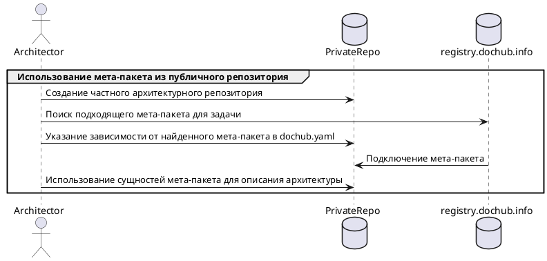
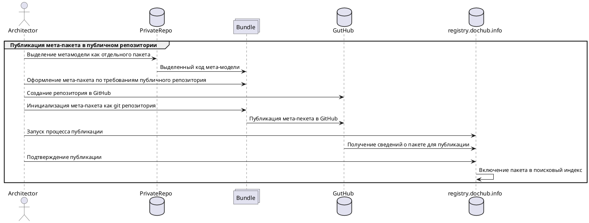

# Метамодель в DocHub

Метамодель архитектуры представляет собой высокоуровневую абстракцию, описывающую сущности предметной области и их 
отношения. Она позволяет сформулировать общее представление о предметной области, не углубляясь в детали. Простой 
аналог архитектурной метамодели — это схема реляционной базы данных, которая включает таблицы, поля, индексы и хранимые
процедуры, но не содержит данных. Исходя из этой схемы, можно понять, какие задачи может решать такая база данных,
однако данных в ней нет.

Эффективное управление метамоделью позволяет предприятию системно анализировать и оптимизировать свою архитектуру,
выявляя области для улучшения, повышения эффективности и снижения рисков.

Ключевым требованием к метамодели является её способность адаптироваться к меняющимся потребностям организаций. Это 
достигается через постоянный мониторинг и анализ предметной области, а также внедрение необходимых изменений в
метамодель. В результате метамодель становится живой и динамичной структурой, которая развивается синхронно с 
организацией, позволяя ей оставаться конкурентоспособной и эффективной в условиях быстро меняющейся внешней среды.

DocHub удовлетворяет выше описанных потребностей за счет трех аспектов:

*   **Entity**:             ([Сущности](@document/dochub.flex_metamodel.entities)) DocHub позволяет свободно создавать
                            и расширять сущности, которые представляют собой образы объектов предметной области и их
                            взаимоотношения;
*   **Rules**:              ([Правила](@document/dochub.rules)) Архитектор имеет широкие возможности для создания правил,
                            которые контролируют реализацию метамодели;
*   **Bundle**:             ([Мета-пакеты](@document/dochub.flex_metamodel.bundle)) DocHub позволяет создавать модули
                            мета-модели похожие на модули приложений, которые представляют собой самодостаточные,
                            отчуждаемые части кода архитектуры.

В результате, DocHub обеспечивает гибкое управление метамоделью, позволяя архитектору создавать конфигурацию, которая
соответствует конкретным потребностям и характеристикам требуемой предметной области и этапу ее развития. В терминах
DocHub такая конфигурация называется - **"Частная метамодель"**.

## Область применения метамодели


Инфографика иллюстрирует, что метамодель представляет собой артефакт, непосредственно связанный с конкретной предметной
областью. Степень формализации метамодели варьируется в зависимости от уровня её зрелости и общей степени цифровизации.
При этом, чем менее зрелой является предметная область, тем больше у неё потенциал для роста и изменений, что усиливает
требования к гибкости средств управления развитием метамодели.

В условиях такой оценки реальности единая метамодель оказывается неэффективной. Важно осознать, что метамодель должна
эволюционировать и оставаться оптимальной как для конкретной предметной области, так и для её уровня зрелости,
адаптируясь к возникающим изменениям.

Кроме того, метамодель должна обеспечивать связь между сущностями различных предметных областей, поскольку они часто
пересекаются в архитектурном ландшафте организаций.

## Entity (Сущности)

Сущность формализует объекты предметной области, их взаимоотношения, а также представляет их в необходимом виде.

Пример реализации учебной сущности [**interactions**](@document/dochub.flex_metamodel.entities):
```code-frame
entities/interactions
```

Подробно создание этой сущности рассматривается [здесь](@document/dochub.flex_metamodel.entities). Также можно изучить пример
реализации нотации [C4 Model](https://github.com/DocHubTeam/DocHubExamples/tree/main/src/C4Model) и пример расширения презентаций
уже существующих сущностей путем встраивания [виджетов](https://github.com/DocHubTeam/DocHubExamples/tree/main/src/widgets).

## Rules (Правила)

DocHub предлагает два мощных инструмента для управления метамоделью и описания архитектуры:
1. **Подсистема контроля**  - Вы можете задать любые алгоритмические проверки, которые будут уведомлять о выявленных отклонениях.
                              Подробности о работе подсистемы доступны в отдельном [разделе](@document/dochub.rules).
3. **Схемы данных**         - При описании сущностей вы получаете возможность точно определить их схемы данных с помощью
                              JSONSchema. Это описание позволяет контролировать корректность описания объектов сущностей,
                              их взаимосвязи, а также параметры, необходимые для работы презентаций.

Пример схемы данных учебной сущности [**interactions**](@document/dochub.flex_metamodel.entities):
```code-frame
entities/interactions/schema
```

## Bundle (Мета-пакет)

Бандл метамодели представляет собой самодостаточную и отчуждаемую часть архитектурного кода. Он может включать в себя все
элементы, характерные для обычного кода. Основная цель его создания заключается в обеспечении переиспользования
архитектурного кода в сторонних кодовых базах в качестве зависимости.

Мета-пакеты могут подключаться как локально, так и из [специального, публичного репозитория пакетов](https://registry.dochub.info/),
являющегося частью экосистемы DocHub.



Ключевой особенностью публичного репозитория является возможность размещать в нем свои мета-пекеты, которыми смогут 
воспользоваться другие архитекторы. 



При использовании мета-пакетов рекомендуется опираться на практики использования модулей приложений. Подробнее
[здесь](@document/dochub.flex_metamodel.bundle).

Для удобной работы с мета-пакетами в экосистеме DocHub есть специальный менеджер пакетов - [Archpkg](https://registry.dochub.info/).
Он обеспечивает управление зависимостями архитектурных репозиториев созданных с использованием подхода "Архитектура как код".
Позволяет быстро и удобно устанавливать, обновлять и удалять пакеты, необходимые для работы архитектурного репозитория.


## Частная метамодель

Частная метамодель, это ансамбль необходимых **вам** бандлов, их расширений, а также описаний сущностей выполненных
**вами** для нужд **вашей предметной области**. 

Такой подход обеспечивает соответствие метамодели реальным потребностям **ваших** контрагентов, позволяя удовлетворять 
их как в настоящем, так и в будущем. Это создает условия для успешной работы архитектора, обеспечивая эффективное управление
архитектурой и доставку ценности в нужной форме и качестве.
