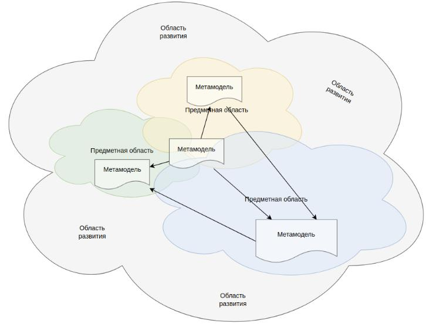

# Метамодель в DocHub

Метамодель архитектуры представляет собой высокоуровневую абстракцию, описывающую основные компоненты и взаимосвязи
системы, позволяя понять сложность и взаимодействия различных элементов. Управление метамоделью позволяет предприятию
системно анализировать и оптимизировать свою архитектуру, выявляя области для улучшения, повышения эффективности и
снижения рисков.

Ключевым требованием к метамодели является ее способность адаптироваться к меняющимся потребностям компании. Это 
достигается путем постоянного мониторинга и анализа предметной области, а также путем внедрения необходимых изменений
в метамодель. Таким образом, метамодель становится живой и динамичной структурой, которая синхронно развивается с
компанией, позволяя ей оставаться конкурентоспособной и эффективной в быстро меняющемся бизнес-ландшафте.

DocHub обеспечивает гибкое управление метамоделью за счет предоставления архитектору свободы выбора при ее развитии.
Это достигается следующими ключевыми свойствами:

*   **Entity**:             (Сущности) DocHub позволяет свободно создавать и расширять сущности, которые представляют
                            собой образы объектов предметной области и их взаимоотношения;
*   **Rules**:              (Правила) Архитектор имеет широкие возможности для создания правил, которые контролируют
                            реализацию метамодели;
*   **Bundle**:             (Мета-пакеты) DocHub позволяет создавать модули мета-модели похожие на модули приложений,
                            которые представляют собой самодостаточные, отчуждаемые части кода архитектуры.

В результате, DocHub обеспечивает гибкое управление метамоделью, позволяя архитектору создавать конфигурацию, которая
соответствует конкретным потребностям и характеристикам требуемой предметной области и этапу ее развития. В терминах
DocHub такая конфигурация называется - **"Частная метамодель"**.

## Область применения метамодели



Метамодель явно представляет собой артефакт, связанный с конкретной предметной областью. Формализация метамодели зависит
от уровня ее зрелости и степени цифровизации в данной области.

Кроме того, чем менее зрелой является предметная область, тем больше у нее потенциал для роста и изменений.

В условиях такой оценки реальности единая метамодель оказывается неприменимой. Важно признать очевидный факт: метамодель
должна эволюционировать и оставаться оптимальной как для конкретной предметной области, так и для ее уровня зрелости,
адаптируясь к изменениям.

Кроме того, метамодель должна обеспечивать связь между объектами различных предметных областей, поскольку они часто
пересекаются в архитектурном ландшафте.

## Entity

Сущность формализует объекты предметной области, их взаимоотношения, а также представляет их в необходимой форме.

Пример реализации учебной сущности [**interactions**](@document/dochub.flex_metamodel.entities):
```code-frame
entities/interactions
```

Подробно создание этой сущности рассматривается [здесь](@document/dochub.flex_metamodel.entities). Также можно изучить пример
реализации нотации [C4 Model](https://github.com/DocHubTeam/DocHubExamples/tree/main/src/C4Model) и пример расширения презентаций
уже существующих сущностей путем встраивания [виджетов](https://github.com/DocHubTeam/DocHubExamples/tree/main/src/widgets).

## Metamodel Bundle

Бандл метамодели - самодостаточная, отчуждаемая часть кода архитектуры. Он может содержать все то же, что обычный код.
Целью его создания является - переиспользование архитектурного кода в сторонних архитектурных кодовых базах
в качестве зависимости.

Подробнее [здесь](/docs/dochub.flex_metamodel.bundle).

## Частная метамодель

Частная метамодель, это ансамбль необходимых **вам** бандлов, их расширений, а также описаний сущностей выполненных
**вами** для нужд **вашей предметной области**. 

Такой подход гарантирует адекватность метамодели действительным потребностям бизнес-единицы. Дает возможность удовлетворить их
как в настоящем, так и в будущем. Создает условия для успешности архитектора в поставки ценности от управления
архитектурой в адекватной форме и качестве. 
